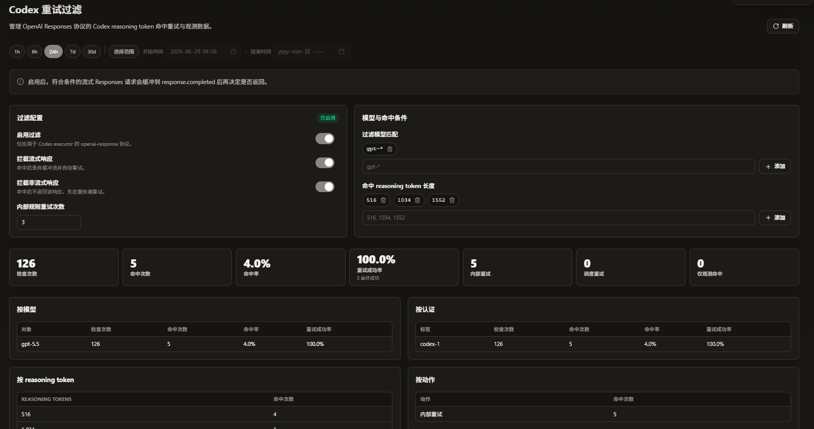

# CLIProxyAPI-Enhance

[中文](README_CN.md) | [日本語](README_JA.md)

This repository is a fork of [router-for-me/CLIProxyAPI](https://github.com/router-for-me/CLIProxyAPI), with the following major additions:

## Features

### Usage Statistics & Persistence
- Built-in SQLite-based request usage statistics persistence, supporting aggregated queries by provider, model, and auth dimensions
- Usage query APIs such as `/v0/management/usage`
- Statistics page with filtering by time range, provider, model, auth, etc.

### Keyword Response Filtering
- Detect configured keywords in upstream streaming responses for provider quota, policy, or custom failure text
- Supports OpenAI Chat Completions, OpenAI Responses/Codex, Anthropic/Claude, and Gemini-compatible stream formats
- Matching responses are recorded as failed usage with `keyword_filtered`, including the matched keyword and bounded response context
- Matching failures can trigger provider fallback and cooldown when another provider is available
- Manage rules through `/v0/management/keyword-filters` or the management panel

### Codex Responses Retry Filter
- Temporary Codex/OpenAI Responses-only retry guard for known incomplete reasoning-token completion patterns
- Supports configurable enablement, model glob matching, matched reasoning-token lengths, stream/non-stream interception, and guard retry attempts
- Default matching targets `gpt-*` models and reasoning token lengths `516`, `1034`, and `1552`
- Matching requests are retried internally or through the conductor without returning the synthetic retry error to clients
- Persists attempts, hits, hit rate, retry success rate, matched lengths, actions, auth labels, and recent hit details in SQLite
- Manage the feature through `/v0/management/codex-response-retry-filter` or the matching management panel page
- This feature requires the matching frontend implementation from
  [xzhao4545/Cli-Proxy-API-Management-Center-Ehance](https://github.com/xzhao4545/Cli-Proxy-API-Management-Center-Ehance),
  including `src/pages/CodexRetryFilterPage.tsx`,
  `src/pages/CodexRetryFilterPage.module.scss`, and the related locale entries. Older frontend builds do not contain this page.

### Provider Custom Label
- Set a custom name (`label` field) for AI providers
- Displayed as the label name in the management panel provider list; auto-generates `{brand}#{seq}` format when unset

### Default Frontend Management Panel
- The built-in management panel URL is pointed to the accompanying frontend:
  [xzhao4545/Cli-Proxy-API-Management-Center-Ehance](https://github.com/xzhao4545/Cli-Proxy-API-Management-Center-Ehance)
- The frontend interacts with the backend via `/v0/management/*` APIs, providing config management, provider management, usage statistics, etc.

## Configuration

```yaml
# Usage statistics persistence configuration
usage:
  enabled: true                    # Enable SQLite persistence statistics
  sqlite-path: ./data/usage.db     # Database path (default as above)

# Response keyword filtering
keyword-filters:
  - keyword: "insufficient credits"
    match-mode: "anywhere"         # anywhere, start, end, exact
    case-sensitive: false
    enabled: true

# Codex/OpenAI Responses retry filter
codex-response-retry-filter:
  enabled: false
  models:
    - "gpt-*"
  reasoning-token-lengths:
    - 516
    - 1034
    - 1552
  intercept-streaming: true
  intercept-non-streaming: true
  guard-retry-attempts: 3

# Remote management panel configuration
remote-management:
  panel-github-repository: https://github.com/xzhao4545/Cli-Proxy-API-Management-Center-Ehance
  disable-auto-update-panel: false # Whether to disable panel auto-update
```

## Screenshots

### Codex Responses Retry Filter



### Usage Statistics


## Upstream Documentation

For upstream features (multi-account load balancing, OAuth authentication, Amp CLI integration, etc.), see:
- https://github.com/router-for-me/CLIProxyAPI

## License

MIT
