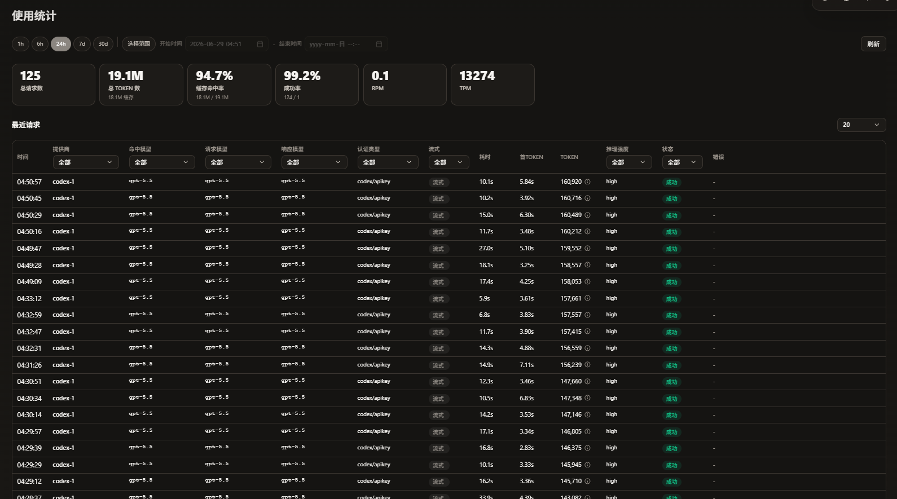

# CLIProxyAPI-Enhance

[English](README.md) | [日本語](README_JA.md)

本仓库 Fork 自 [router-for-me/CLIProxyAPI](https://github.com/router-for-me/CLIProxyAPI)，在其基础上主要增加了以下功能：

## 新增功能

### 使用统计与持久化
- 内置基于 SQLite 的请求用量统计持久化，支持按 provider、model、auth 维度的聚合查询
- 提供 `/v0/management/usage` 等统计查询 API
- 支持按时间范围、provider、模型、auth 等条件筛选的统计页面

### 响应关键字过滤
- 可在上游流式响应中检测配置的关键字，用于识别供应商额度、策略限制或自定义失败文本
- 支持 OpenAI Chat Completions、OpenAI Responses/Codex、Anthropic/Claude 和 Gemini 兼容流式格式
- 命中后会以 `keyword_filtered` 记录为失败用量，并包含命中的关键字和受限长度的响应上下文
- 有可用备用供应商时，命中失败可触发供应商故障转移和冷却
- 可通过 `/v0/management/keyword-filters` 或管理面板维护规则

### 提供商自定义标签
- 可为 AI 提供商设置自定义名称（`label` 字段）
- 在管理面板提供商列表中显示为标签名，未设置时自动生成 `{brand}#{序号}` 格式

### 默认前端管理面板
- 默认内置的管理面板地址已指向本项目的配套前端：
  [xzhao4545/Cli-Proxy-API-Management-Center-Ehance](https://github.com/xzhao4545/Cli-Proxy-API-Management-Center-Ehance)
- 前端通过 `/v0/management/*` 接口与后端交互，提供配置管理、提供商管理、用量统计等功能

## 配置

```yaml
# 使用统计持久化配置
usage:
  enabled: true                    # 启用 SQLite 持久化统计
  sqlite-path: ./data/usage.db     # 数据库路径（默认如上）

# 响应关键字过滤配置
keyword-filters:
  - keyword: "insufficient credits"
    match-mode: "anywhere"         # anywhere、start、end、exact
    case-sensitive: false
    enabled: true

# 远程管理面板地址配置
remote-management:
  panel-github-repository: https://github.com/xzhao4545/Cli-Proxy-API-Management-Center-Ehance
  disable-auto-update-panel: false # 是否禁用面板自动更新
```

## 截图

### 使用统计



## 上游文档

原项目功能（多账户负载均衡、OAuth 认证、Amp CLI 集成等）请参考：
- https://github.com/router-for-me/CLIProxyAPI

## License

MIT
